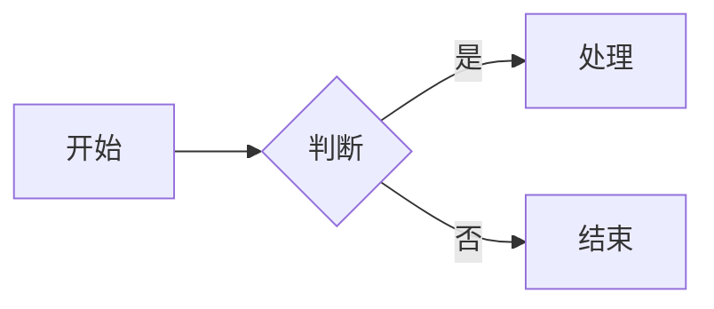

# 文档首页

欢迎来到 **ERON VISUAL STUDIO** 文档站点。

所有文档和配置文件统一放在 `docs/` 目录下，侧边栏、导航栏、封面等配置也在此目录中。新增文章时只需在 `docs/` 下创建 `.md` 文件，然后更新 `_sidebar.md` 添加链接即可。

## 目录

- [个人日记](daily/myself.md)
- [编程笔记](program/my-script.md)

## Mermaid 示例



## MathJax 示例

行内公式：$E=mc^2$。

块级公式：

$$
\int_{0}^{\pi} \sin x\, dx = 2
$$

---

## 可用功能

| 功能 | 说明 | 用法 |
|------|------|------|
| Mermaid 图表 | 流程图、时序图、甘特图等 | 使用 ```mermaid 代码块 |
| MathJax 公式 | LaTeX 数学公式渲染 | 行内 `$...$` 或块级 `$$...$$` |
| Emoji | :smile: :+1: :rocket: | 使用 `:emoji_code:` |
| 搜索 | 全文搜索 | 按 `Ctrl+K` / `Cmd+K` |
| 图片缩放 | 点击图片可放大 | 点击任意图片 |
| 代码复制 | 一键复制代码 | 代码块右上角按钮 |
| 分页导航 | 上下页翻页 | 页面底部自动出现 |
| 更新时间 | 显示最后修改时间 | 在页面末尾显示 |

---

*最后更新：{docsify-updated}*

> 💡 在 `docs/` 下创建新的 `.md` 文件后，记得更新 `_sidebar.md` 添加导航链接。