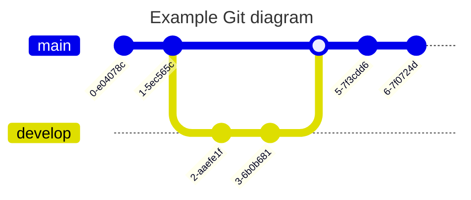

mermaid  
{: .label}

# mermaid

> [https://mermaid.js.org/](https://mermaid.js.org/)  

## demos

### flowchart/graph

> 流程图

### sequence

> 时序图

### class

> 类关系图, 可以描述类之间的继承组合关系

### entity relation

> 实体关系图 : 一般可以表达数据库表之间的关系

### state

> 状态转换图, 描述自动转换机的状态变化比较方便合适

### user journey

> 用户旅程 

### gantt

> 甘特图, 表示各个任务的进展和当前状态

也可以作成柱状图表示数据, 一个特别的使用方法 : )

### pie and quadrant

~~`Obsidian`暂时不支持mermaid最新绘图类型, IDEA的插件是支持的~~  

### git

## actually scene usage

> 实际场景中的表达实践, 将之前的思路完整使用编程绘图语言描述  

## other similar

> 其他一些类似的工具和推荐, 关于markdown draw 整理知识相关的编辑器  

- [PlantUML](https://plantuml.com/zh/)  
- [Graphviz](https://graphviz.org/)  
- [Typora](https://typora.io/)  
- [Joblin](https://joplinapp.org/)  
- [Swimm](https://swimm.io/)  

