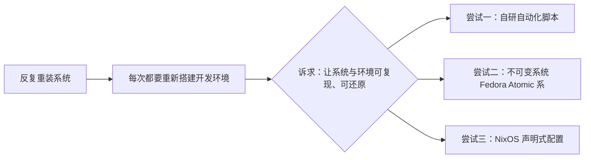

# 关于「可重现开发环境」的折腾与思考

> 备注：文档是根据我的口述表达和描述，利用AI生成的，后期经过我简单修改而成

---

> 每一次重装系统，都是一场对记忆力和耐心的双重考验。  
> 真正难的从来不是装系统，而是把那个「顺手到仿佛从未离开过」的开发环境，原封不动地搬回来。  

---

## 一、缘起

和很多爱折腾的人一样，我有过一段频繁重装系统的时期。理由五花八门：桌面环境想换口味了、系统卡顿想回归清爽、某个驱动搞坏了想推倒重来、看到新版本忍不住想尝鲜……

每次流程大致是：

1. 装系统本身：格式化、引导、基础设置，半小时到一小时；
2. 装驱动与基础软件：输入法、浏览器、常用工具；
3. **最要命的环节——重建开发环境**：JDK、Node、Python、数据库、IDE 及其插件、SSH 密钥、全局配置、环境变量、各类小工具……零零散散能搭上大半天，甚至一整天。

这套流程走个三五遍，一个很朴素的问题就浮现出来了：

> 为什么我明明已经「熟门熟路」，却还是要花一整天重复这些毫无创造力的劳动？

细想之下，痛点其实有三个：

- **大量重复劳动**：同样的事情一遍遍做，纯属浪费生命；
- **依赖大脑记忆**：配置全靠回忆，「当初我到底改过哪个环境变量」这种问题每次都要重新排查；
- **不可回溯**：装到一半想不起当初的某个选项，只能凭感觉再试一次。

更别提配置散落在各处：改了 `.bashrc`、调了 IDE 设置、装了几个「好像需要」的包……**一切状态都只存在于我的脑子里和这台机器上，没有任何形式能让我在另一台机器上快速还原。**

于是，「如何快速重现我的系统与开发环境」成了我折腾路上的一个执念。

---

## 二、「经验」脚本

第一次尝试的思路非常直接：**既然我每次都做同样的事，那就让脚本替我做。**

于是我开始写自动化脚本：把软件安装清单、配置写入、目录创建等操作固化成一段段 Shell，试图做到「跑一遍脚本，环境回来大半」。

> <a href="../../resource/files/system-rebuild-shell.sh" download>debian系、rh系重装脚本</a>
 

### 当时的收获

- 方向感是对的：把「大脑里的经验」转成「可执行的代码」，这本身就是一种沉淀；
- 常用软件的安装确实被加速了，至少在换机的头几个小时里不用再对着文档一条条复制粘贴。

### 遇到的实际问题

写着写着，现实问题就来了：

- **覆盖面失控**：JDK、Node、Python、数据库、编辑器、插件、字体、输入法……清单越列越长，脚本越写越臃肿；
- **机器之间存在差异**：发行版不同、版本不同、显卡不同、个人习惯不同，脚本里充满了各种 `if` 分支来兜底；
- **难以保证幂等**：同样的脚本跑两遍，结果可能不一样——重复安装、重复写入、报错中断，都需要额外处理；
- **维护成本超过收益**：每升级一个软件，都要回来改脚本。到最后，「维护这套脚本」本身变成了一项负担。

于是这个方案写了个大概，最终停留在「半成品」状态——**方向正确，但用一个人手写的脚本去硬扛一整个系统，很快会触碰到维护成本的临界点。**

> 事后反思：这一类问题其实已经有相对成熟的解法（dotfiles 管理、Ansible、chezmoi 等），「从零手写轮子」往往是最有成就感、也最容易半途而废的一条路。

---

## 三、Fedora Atomic 系

后来，我接触到了 Fedora 的**不可变系统**（当时主要是 Silverblue，后来是整个 Atomic Desktop 系列）。

它的理念一度非常打动我：

- **系统根分区只读**，以镜像（ostree）方式整体管理；
- **原子化更新**：系统升级像「换一张系统盘」一样整体切换，失败可以瞬间回滚；
- 应用层交给 **Flatpak** 沙箱隔离，界面清爽、互不污染。

对于一个「三天两头把系统玩坏」的人来说，「系统坏了可以一键回滚」简直是一种救赎。

### 开发环境拦路虎

真正上手开发后，问题暴露了：**不可变系统把「系统」管好了，却没有把「开发环境」安排好。**

- 系统层被锁死之后，传统的 `dnf install`、往 `/usr`、`/opt` 里装开发工具链的路子走不通了；
- 官方的解法是把开发环境放进 **toolbox / distrobox** 之类的容器里——一个容器一个环境，互不干扰，这理念本身没毛病；
- 但对我而言，这就碰到了你说的那个核心痛点：**开发环境之间、宿主机与容器之间不互通。**

实际使用中到处都是小麻烦：

- 容器内外工具链割裂，A 项目一个容器、B 项目一个容器，版本、路径、配置各自为政；
- 涉及 IDE、远程调试、图形界面程序、USB/权限等场景时，容器要多做一层透传与配置；
- 数据、密钥、缓存散落在不同容器里，来回切环境像在搬家。

我要的其实是**一个整体顺手、开箱即用的开发环境**，而不是被拆成一堆互不相认的「沙箱」。这个矛盾让我最终放弃了 Fedora 不可变系统这条路线。

> 事后反思：不可变系统解决的是「系统可回滚、可恢复」，这很好；但它没有解决我「开发环境要整体可重现、要顺手」的核心诉求，反而引入了一层新的隔离成本。**工具是对的，只是没对准我的问题。**

---

## 四、NixOS

> NixOS 的「声明式」理想

再后来，我了解到了 NixOS 以及它背后的 Nix 生态。它几乎把「可重现」这件事做到了理论上的极致：

- **整个系统 = 一份配置文件**：装什么软件、开什么服务、改什么配置，全部写在 `/etc/nixos/configuration.nix` 里；
- **环境即代码**：一份配置，即可在任何机器上复现出几乎一致的系统；
- **可回滚、可多版本共存**：连依赖都能精确锁定到 hash 级别。

从「复现开发环境」的角度看，NixOS 几乎是终极答案——**配置本身就是备份。**

### 为什么我没有走下去

理想很丰满，现实很骨感。结合我的实际处境，有几个现实障碍：

- **国内网络环境不友好**：Nix 的包与二进制默认依赖海外源，安装与构建需要折腾国内镜像源（社区镜像、`nix.conf` 配置等），「开箱即用」变成「先折腾半小时再用」；
- **技术生态在国内不流行**：资料、社区、踩坑经验都以英文和海外为主，遇到问题排查路径更长；
- **学习成本陡峭**：Nix 语言、flake、nixpkgs 的包写法，对普通使用者来说是一整套全新的心智模型；
- **成熟度感受**：即便它理念超前，但日常使用中的各种边角问题、包维护质量参差，让它更像「极客的乐高」而非「生产环境的底座」。

综合评估投入产出比后，我选择暂时搁置。**不是说它不好，而是现阶段我为它付出的学习与维护成本，超出了我能获得的收益。**

---

## 五、对比与沉淀

三次尝试走下来，我把诉求重新梳理了一遍。**我真正想要的并不是「某个系统的备份」，而是这几件事：**

1. **可复现**：一份配置/清单，在任意机器上能还原出基本一致的环境；
2. **低维护**：不要为了「管理环境」而花更多时间去维护管理环境本身的工具；
3. **低心智负担**：日常开发别被「环境」绑架，工具应该隐形而不是成为主角。

| 方案 | 核心思路 | 优点 | 痛点 | 我的结论 |
|------|---------|------|------|---------|
| 自研脚本 | 把重复操作写成代码 | 灵活、贴合个人习惯 | 覆盖面难控制、幂等性差、维护成本高 | 半成品搁置，方向可借鉴 |
| 不可变系统（Fedora Atomic 系） | 系统镜像化、原子更新 | 系统可回滚、更新安全 | 开发环境被容器隔离、互不互通、上手繁琐 | 解决系统不解决环境，放弃 |
| NixOS | 全系统声明式、配置即环境 | 可复现性天花板、可回滚 | 国内生态不友好、门槛高、成熟度存疑 | 理念认同，现阶段搁置 |

结合这些对比，我沉淀出几个更深一层的想法：

### 1. 把「状态」变成「声明」，而不是变成「步骤」

脚本写的是「怎么做」（先装 A 再改 B），而配置/清单描述的是「要什么」（系统里要有 A 和 B，且状态如此）。**后者更容易被校验、被重复执行、被版本管理。** 这也是 NixOS 和 dotfiles 的核心优雅之处。

### 2. 可回滚和幂等，是自动化的安全感来源

没有回滚能力、不能重复执行的「自动化」，用起来总是提心吊胆。这也是为什么容器镜像、系统快照这些机制值得重视——**它们让「试错」变得便宜。**

### 3. 分层解耦：系统层 / 应用层 / 开发环境层分开管理

- **系统层**：交给发行版与快照/备份工具，别自己在里面折腾；
- **应用层**：交给包管理器和 Flatpak 这类成熟机制；
- **开发环境层**：用 dotfiles、清单、容器镜像（如 devcontainer）这类「配置即代码」的方式去管理。

**一个人不该硬扛整个系统的重现，而应该把每一层交给它最擅长的工具。**

### 4. 拥抱成熟生态，好过重复造轮子

自研脚本的半途而废给我最大的教训是：**凡是自己已经感到「维护不动」的轮子，多半是生态里早就有了更好的替代品。** 先把现成的成熟方案用好，再决定要不要造轮子。

---

## 六、改进方向

虽然三次系统级的尝试都暂时搁置了，但「让环境可重现」这件事并没有结束。结合上面的沉淀，我给自己列了一些更低门槛、随时可做的方向：

- **建立 dotfiles 仓库**：把 `.bashrc`、`.gitconfig`、编辑器配置等集中管理，配合软链接一键部署到新机器；
- **写一份「环境依赖清单」**：哪怕只是 Markdown/脚本，把装了哪些软件、为什么装、怎么配写清楚——文档本身就是可重现的第一步；
- **把开发环境容器化**：用 Dockerfile / devcontainer 固化某一类项目的依赖，项目级可重现，代价远低于全系统方案；
- **善用系统快照/备份**：在关键节点给系统留后路，让「重装」从「冒险」变成「有兜底的操作」；
- **保持工具敏感度**：NixOS 这类方案不必一棒子打死，等它的国内生态与成熟度上来了，也许某天会重新纳入考虑。

---

## 七、写在最后

折腾了这一圈，最大的感受是：

> **重装系统本身不可怕，可怕的是重装之后一切要「无中生有」。**

真正能解决「环境重建难」的，不是某一个发行版，也不是某一个工具，而是一种意识——**别把环境只存在机器里，要把它存在「可执行、可复现」的形式里。**

从手写脚本，到不可变系统，再到 NixOS，每一次尝试都让我更清楚自己要什么、不要什么。也许哪天我会再捡起 NixOS，也许会有更顺手的新方案出现——但无论工具怎么变，**「配置即代码、环境可重现」这个思路，会一直留在我这里。**

路还长，继续折腾，继续沉淀。

---

*最后更新：{docsify-updated}*
