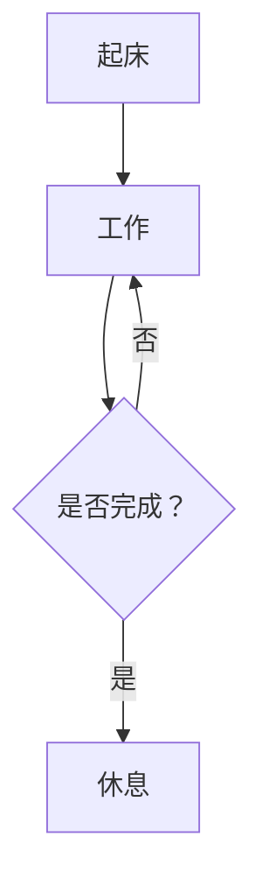

# 我的日记

> 记录日常点滴与思考。

## 2026 年 5 月

### 5 月 4 日

今天配置了 Docsify 文档站点，支持了 Mermaid 图表和 MathJax 数学公式。

### Mermaid 示例

### MathJax 示例

能量公式：$E = mc^2$

正态分布：

$$
f(x) = \frac{1}{\sigma\sqrt{2\pi}} e^{-\frac{1}{2}\left(\frac{x-\mu}{\sigma}\right)^2}
$$
