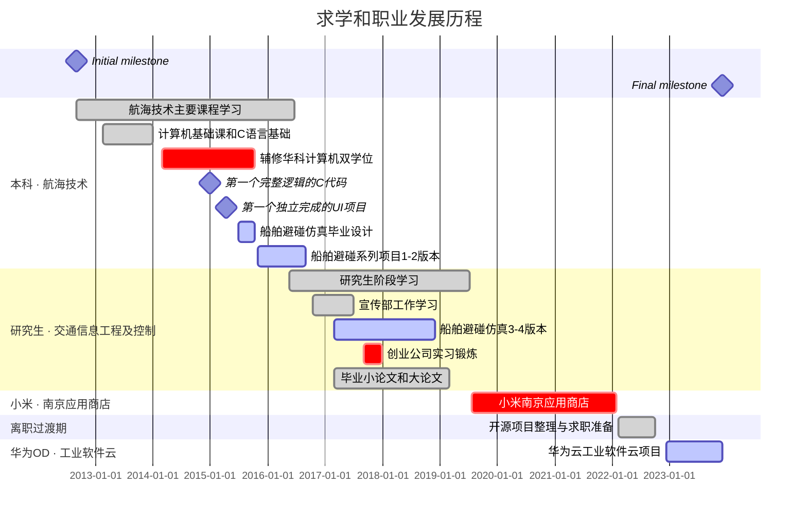

# 我的简历

> 永不言弃 · 保持自信 · 坚守职业素养

## 👤 基本信息

- **姓名**：王玉龙（WANG ERON）
- **出生年份**：1993
- **求职意向**：软件工程师 / 全栈工程师 / 设计师
- **联系邮箱**：wangyulong.eron@outlook.com
- **教育背景**：武汉理工大学·航运学院（硕士 / 本科）｜华中科技大学·计算机（辅修双学位）
- **简历文件**：<a href="../../resource/files/应聘软件工程师-王玉龙-简历.docx" download>中文简历（.docx）</a> · <a href="../../resource/files/Apply-for-a-Software-engineer-WangYuLong-Resume.docx" download>英文简历（.docx）</a>  
- **代码平台**：[GitHub](https://github.com/naveron)  · [Codeberg](https://codeberg.org/naveron)  · [CNB](https://cnb.cool/u/wangyulong.eron)
- **社交平台**：[博客园](https://www.cnblogs.com/naveron/) · [掘金](https://juejin.cn/user/2930660083507819) · [知乎](https://www.zhihu.com/people/wangyulong.eron) · [B站](https://space.bilibili.com/89060131)

## 📌 个人简介

> 具备「船舶仿真 × 互联网后端」复合背景的全栈软件工程师。硕士主攻船舶避碰仿真，毕业后先后就职于小米、华为（OD），专注后端服务与平台开发；同时热爱技术写作与界面设计，持续探索航海技术与计算机技术的融合。

## 🎓 教育背景

### 硕士 · 武汉理工大学 · 航运学院 · 交通信息工程及控制

- **时间**：2016.09 - 2019.07
- **研究方向**：船舶避碰仿真软件、避碰规则研究、树莓派应用
- **主要课程**：水上交通建模与仿真、船舶控制理论与技术、船舶交通流实验等

### 本科 · 武汉理工大学 · 航运学院 · 航海技术

- **时间**：2012.09 - 2016.09
- **主要课程**：船舶原理、航海学（地文 + 天文）、船舶操纵与海上搜救等
- **荣誉奖项**：校二等奖学金、优秀学生干部、优秀毕业生、课外培养优秀学生

### 辅修双学位 · 华中科技大学 · 计算机科学与技术

- **时间**：2014.03 - 2015.10
- **主要课程**：离散数学、数据结构、操作系统、编译原理、软件工程等
- **实验课程**：数字逻辑、汇编实验等

## 💼 职业经历

- **华为（OD）· 2022.12 - 2023.12**：工业软件云项目后端开发；基于 Java 与 OAuth2 协议，负责用户登录、权限相关模块，深入研究相关源码。
- **小米 · 2019.07 - 2022.02**：南京应用商店后端软件工程师；主要使用 Java、Spring Boot、JSP、Shell、Python 等。
- **武汉创业公司 · 2017.09 - 2017.11**：7 人初创团队，协助开发基于 [Open edX](https://github.com/openedx/edx-platform) 的在线教育后台，参与 Python 机器学习、爬虫与后端技术选型，正式接触职场。
- **在校项目 · 2015.08 - 2019.04**：基于 Java Swing / JavaFX 开发船舶仿真系列软件及各类小工具。

## 🗓️ 学习与成长历程

> 从航海技术到软件开发，一条不断跨界、持续精进的技术成长之路：

- **2014**：学习 C 语言、辅修计算机双学位，正式接触编程基础
- **2015**：完成首个完整项目——Java AWT/Swing 电话联系人管理，以及命令行火车票购买程序
- **2017**：进入创业公司实习，正式接触职场开发
- **2019**：硕士毕业入职小米（南京应用商店），2022 年 02 月离职
- **2022**：离职后整理项目与知识点备战求职；12 月入职华为 OD， `责` 业软件云项目
- ...

## 🛠️ 技能与技术栈

- **后端开发**：Ja `va、Spring Boot` 实现JSP、OAuth2、RPC、MQ、Redis、Zookeeper、MySQL
- **桌面与仿真**：Java Swing、JavaFX、FXGL
- **脚本与数据**：Python、PyTorch、Shell
- **其他**：Git、Linux、SQLite、树莓派

## 📂 项目经验

### 1. 应用自动化测试与审核后台管理系统

> 技术栈：Java Spring Boot、Redis、Zookeeper、RPC、MQ、JSP、MySQL

- 船舶管理后台：[PracticeSpringboot](https://github.com/NAVERON/PracticeSpringboot) + [PracticeJavaFx](https://github.com/NAVERON/PracticeJavaFx)
- 记账软件思路：[Ledger](https://github.com/NAVERON/Ledger)

### 2. 船舶避碰仿真软件与机器学习应用

> 技术栈：Java Swing、JavaFX、FXGL、Python、PyTorch

- [问题思考与解决](https://github.com/NAVERON/ArbitraryCoding)
- [船舶仿真系列开发](https://github.com/NAVERON/ShipSimulation)
- [脚本与工具制作](https://github.com/NAVERON/ERON)
- [机器学习笔记与应用](https://github.com/NAVERON/MachineLearningNotes)

### 3. 船舶模拟仿真项目

> 致力于完整模拟船舶航行技术、避碰策略与路径规划等核心功能。
