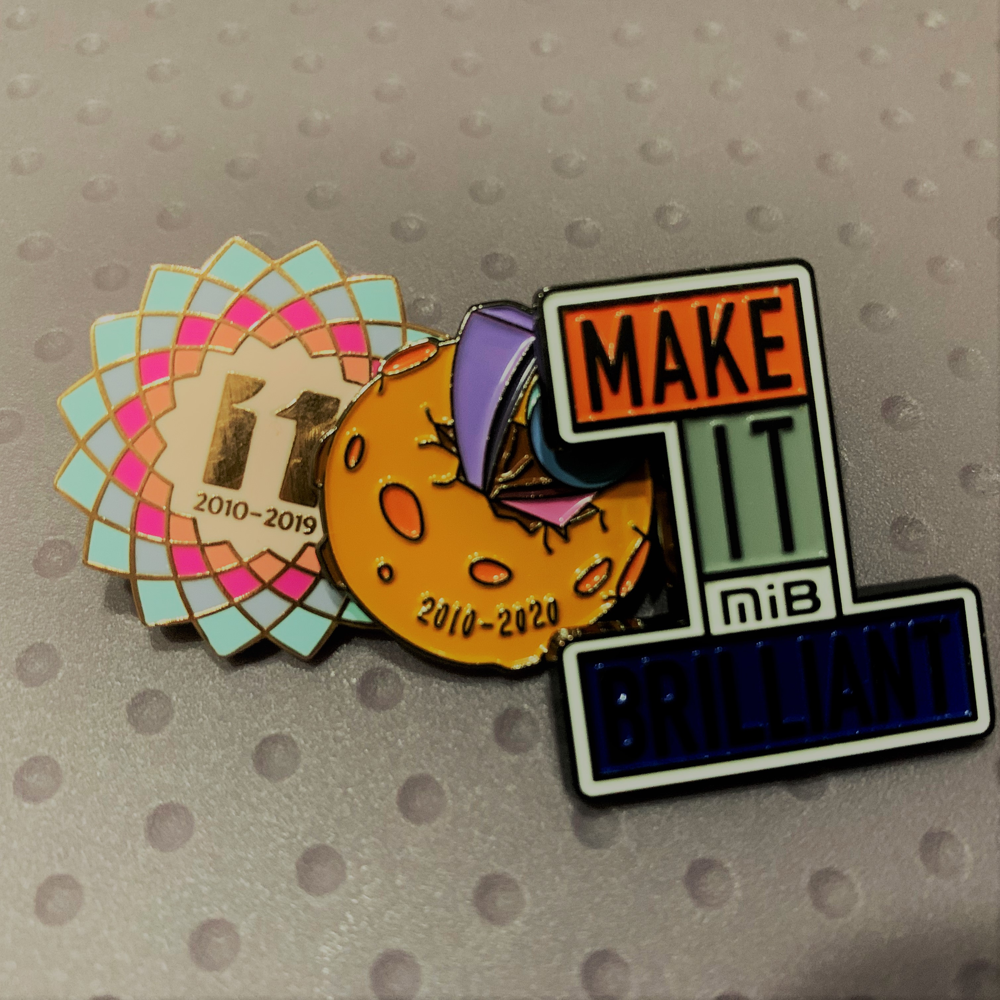

# 零散的笔记  

> 包含之前的日记/笔记和日常的普通记录  

## 极简项目管理读书摘录和有感  

> 2022.03.29

通过开展持续的活动来生产同样的产品或提供重复的服务的工作就是运营，而为创造独特的产品、服务或成果而进行的临时性的工作则是项目  
客户基于他们的阅历与认知，习惯于把自己的需求套到现实中可实现的方法或物质中。在这里，社会公众见过马但没见过汽车，于是他们用“已经见过的马”来描述“还未见过的更快的交通工具（汽车）”，所以他们的回答才会是一匹跑得更快的马  
实际上，针对业务的解决方案才是客户的真实需求  

## 整理杂物有感  

> 2022.08.22

**摘录 : **
此生无非是两件事的较量  
有多难 VS 有多爱    
最终战胜困境的  
唯有热爱  
新的一年  敬无常  
愿你依然有坚持的勇气和期待的欢喜心   

  

整理一些东西, 保存一些东西, 丢掉一些东西, 明白了生活本该如此, 保持热爱, 持续前进, 不用管别人说什么...... 

