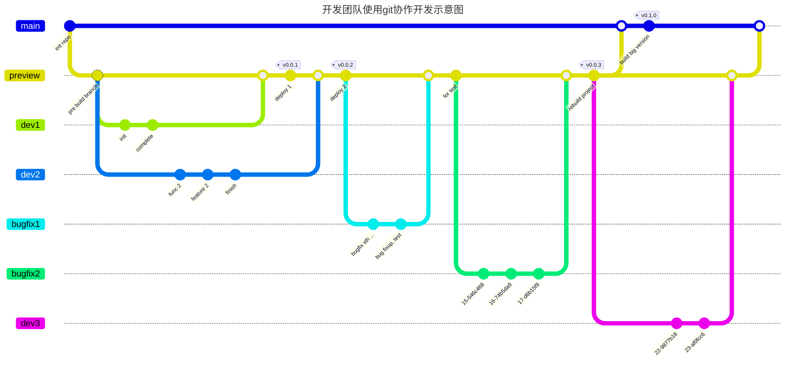

# Git 学习笔记

## Git 资料

> Git 官网地址：[https://git-scm.com](https://git-scm.com)  
> Git 各平台可视化操作客户端：[https://git-scm.com/downloads/guis](https://git-scm.com/downloads/guis)  
> 官方 Git 指南：[Git Probook](https://git-scm.com/book/en/v2)  
> ...

这部分内容主要是我在学习 Git 过程中的整理记录，重点放在命令使用和实际协作思路上，不涉及大而全的教程整理。

> 在线动画演示和练习 Git 的网站：[https://github.com/pcottle/learnGitBranching](https://github.com/pcottle/learnGitBranching)；对应入口：[Learn Git Branching](https://learngitbranching.js.org)

## Git 命令

### Git 本地分支

#### 创建分支

```shell
git branch xxx # 创建分支，但不会切换到该分支
git checkout -b xxx # 创建并切换到新分支
```

#### 撤销变更

通常有两个常见命令：`git reset` 和 `git revert`。

- `git reset`：直接撤销本地修改，通常用于回退到上一个版本，适合自己的本地提交；
- `git revert`：新增一个提交来“回滚”某次提交，适合远程主分支或团队协作场景，因为它保留了历史记录，并能让别人知道某个提交被撤销了。

#### 修改某些 commit

- `cherry-pick`：挑选某个提交，复制到目标分支；
- `rebase -i/--interactive`：可以修改提交顺序、删除多余提交，甚至修改提交信息；
- `git commit --amend`：修改最近一次提交的 message；
- `git tag v1 c1`：给某个提交节点打 tag。

常见例子：`git rebase -i HEAD~4` 可以把当前提交前 4 个 commit 重新整理。

如果需要在某一提交节点打 tag，也可以直接使用 `tag` 命令。

#### Git 的指针 `HEAD`

`git checkout` 其实就是让当前指针指向某个提交，而不一定是某个分支名。每次提交之后，`HEAD` 都会自动跟着前进。

> 每次提交都会生成一个哈希值（SHA-1），可以用 `git log` 查看历史记录。  
> `^` 表示上一个提交，`~<num>` 表示往前跳若干次提交，比如 `git checkout main^` 会让当前指针指向前一个提交。

### Git 远程分支

团队协作时，通常都遵循类似这样的流程：

- 先克隆远程仓库到本地；
- 基于主分支创建自己的开发分支；
- 在自己的分支上编写和提交代码；
- 用 `git fetch` 获取最新远程提交；
- 执行 `git rebase origin/main`，把自己的提交整理到最新主分支之后；
- 解决冲突；
- 用 `git push` 推送改动；
- 在团队协作中，冲突是常见现象，尤其是多人改同一块代码时，最好结合 `rebase` 和良好的项目管理来控制提交节奏。

> `rebase` 和 `merge` 的主要区别在于：`merge` 会保留历史记录，而 `rebase` 会让提交线更整齐、更干净。两者都合理，实际使用中要看具体场景。

#### 追踪分支（trace）

正常情况下，`git pull` 或从远程克隆项目时，Git 会自动创建并关联本地分支与远程分支，例如 `main` 追踪 `origin/main`。  
如果你想手动指定某个本地分支跟踪哪个远程分支，可以用下面的写法：

```shell
git branch -u origin/main xxx 
git checkout -b xxx origin/main && git pull or git push
```

#### push 参数

通常使用 `git push` 时，Git 会把当前本地分支推送到其跟踪的远程分支；但如果需要，也可以显式指定 push 参数。

```shell
git push <remote> <place>
git push origin main
# 表示推送 `main`分支HEAD 到`origin` 中的`main`分支上 
```

更甚至, 想把本地的某一个分支推送到远程其他分支上  

```shell
git push origin <source>:<destination> 
git push origin feature:main
# 以上表示将本地的feature 推送到远程main分支上 
```

#### fetch 参数

和 push 类似，`fetch` 也可以用来同步远程和本地的 commit 记录。

```shell
git fetch origin foo
# 将远程仓库foo分支的提交拉取， 同步到本地 origin/foo 分支上
git fetch origin main:foo # 将远程main提交记录 同步到本地origin/foo 分支上
如果目标分支没有远程, 会直接同步到本地分支
```

> `git fetch`如果不带参数, 会同步所有远程分支到本地对应的远程分支, 拉取最新的提交更新  

`pull` 实际上相当于 `fetch + merge` 的组合。  
一个很有意思的例子是：`git pull origin main:foo`，当前本地分支在 `test` 时，这样会从远程拉取 `main` 分支，并在本地创建 `foo` 分支；`foo` 分支中的提交来自 `main`，随后当前分支再合并这部分内容。

### git 之前的笔记

#### 基本的命令

- 初始化仓库 git init  
- 如果已经在github上有了仓库，或者直接clone，或者初始化后，先pull请求合并，然后push同步到远程仓库  

#### 写作过程中的过程

1. 首先更改某一个文件的内容  
2. `git status`可以表明当前仓库的状态：被修改了什么，哪些没有提交  
  需要提交时，首先需要**add**命令：
3. `git add <filename>`或者`git add .`提交所有文件  
  一次可以提交多个文件，以空格分开  
4. 最后是提交到仓库中，使用`git commit -m "comment..."`命令  
  如果需要提交到远程仓库，使用`git push`命令  

_需要比较文件修改了什么内容，使用`git diff <filename>`命令_  

#### 版本回退问题

HEAD指向当前版本
`git log`查看提交记录，`git reflog`查看命令历史，以便于确定回到哪个版本, 理解**暂缓区**的概念  

#### 分支学习

查看分支：`git branch`  
创建分支：`git branch <name>`  
切换分支：`git checkout <name>`  
切换+创建：`git checkout -b <name>`  
合并某分支到当前分支：`git merge <name>`  
删除分支：`git branch -d <name>`  

## git mermaid 

一般的开发流程/过程表示  



