# Mermaid 学习笔记

> 官方站点：[https://mermaid.js.org/](https://mermaid.js.org/)

Mermaid 是一个很实用的流程图和结构图工具。它不需要复杂的本地安装，直接在 Markdown 里写语法就能生成图，特别适合我这种喜欢用文档记笔记的人。

## 示例

### flowchart/graph

> 流程图

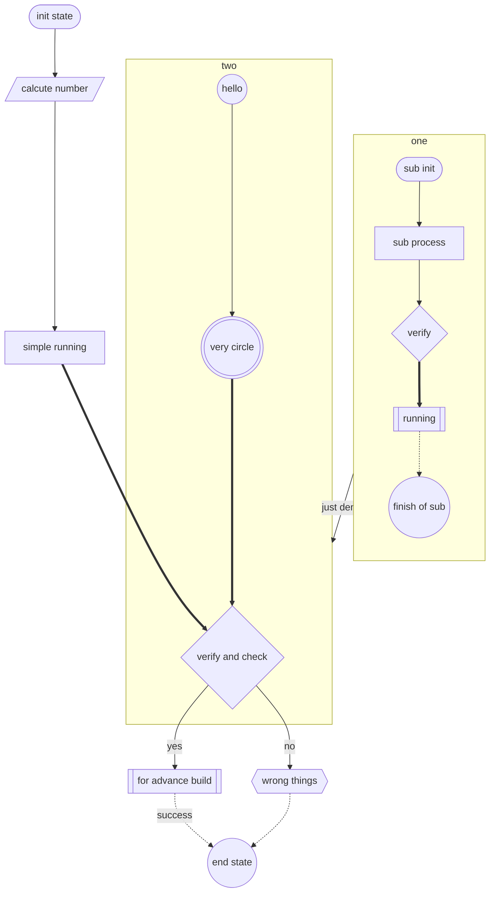

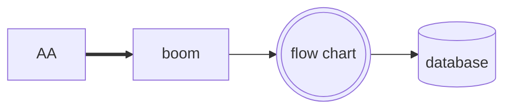

### sequence

> 时序图

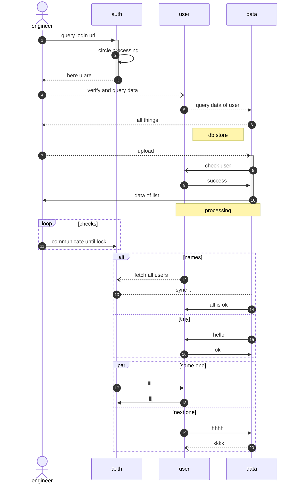

### class

> 类关系图, 可以描述类之间的继承组合关系

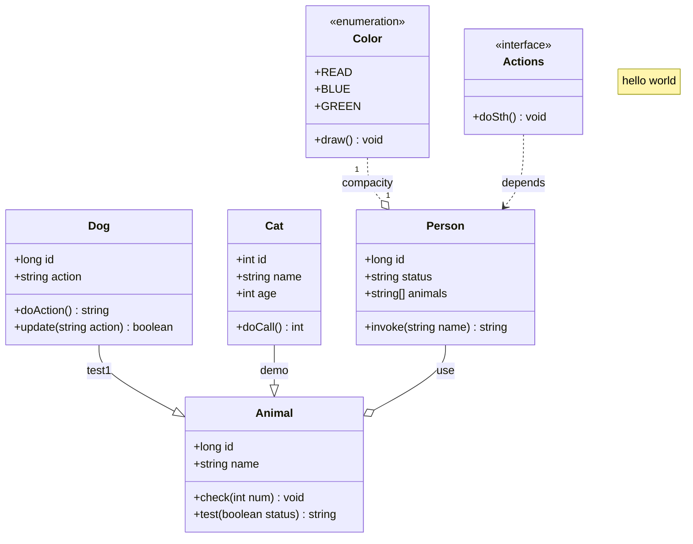

### entity relation

> 实体关系图 : 一般可以表达数据库表之间的关系

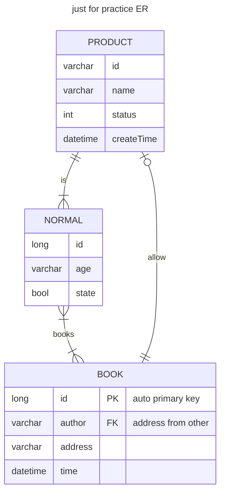

### state

> 状态转换图, 描述自动转换机的状态变化比较方便合适

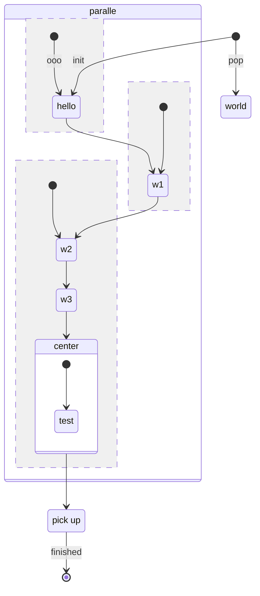

### user journey

> 用户旅程 

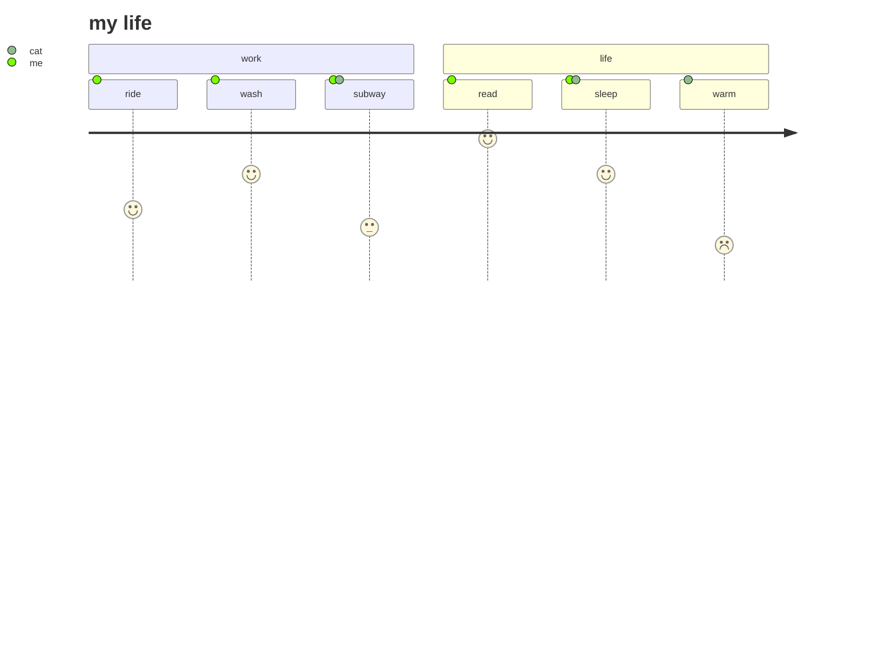

### gantt

> 甘特图, 表示各个任务的进展和当前状态

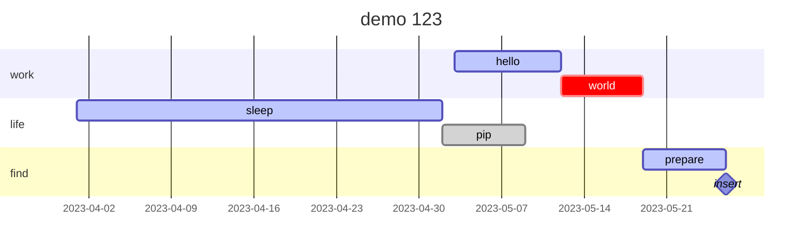

也可以作成柱状图表示数据, 一个特别的使用方法 : )

```mermaid
gantt
    title Git Issues - days since last update
    dateFormat X
    axisFormat %s
    section Issue19062
        71 : 0, 71
    section Issue19401
        36 : 0, 36
    section Issue193
        34 : 0, 34
    section Issue7441
        9 : 0, 9
    section Issue1300
        10 : 0, 10
```

### pie and quadrant

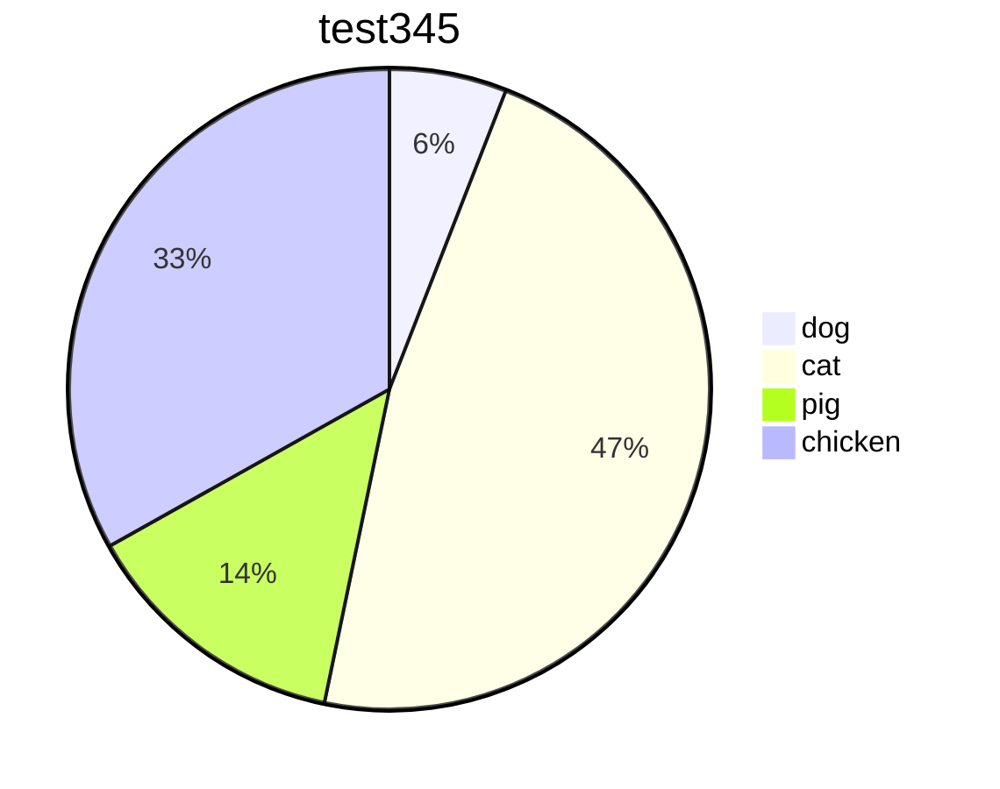

~~`Obsidian`暂时不支持mermaid最新绘图类型, IDEA的插件是支持的~~  

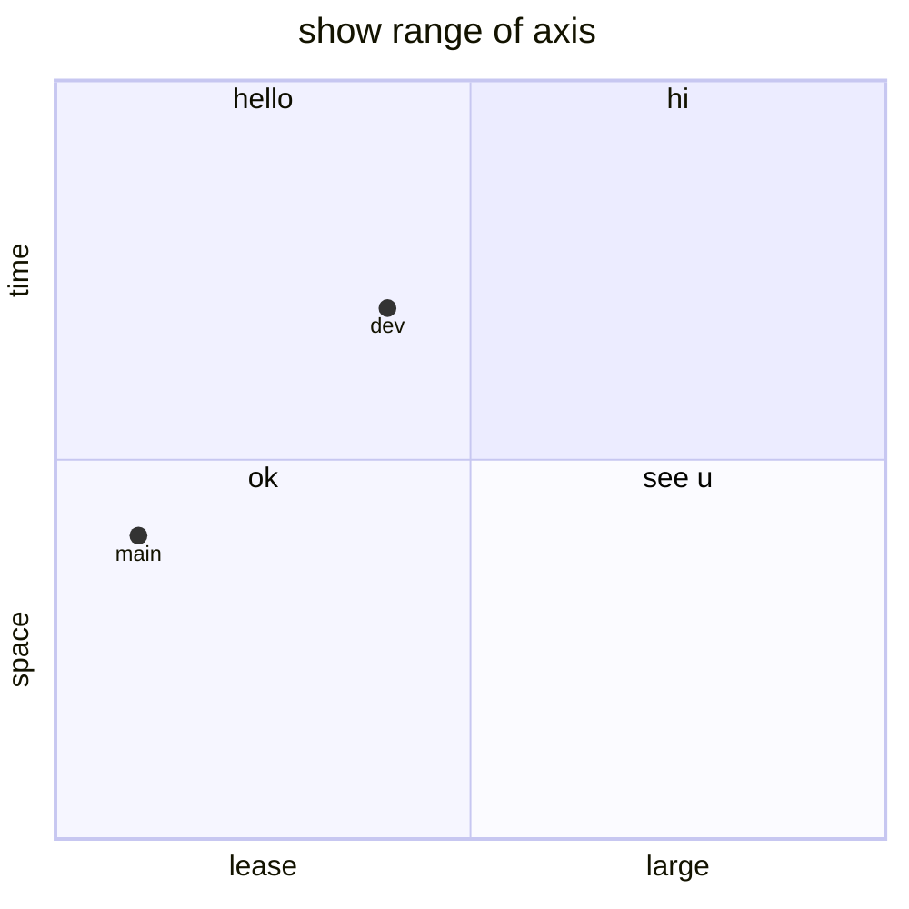

### git

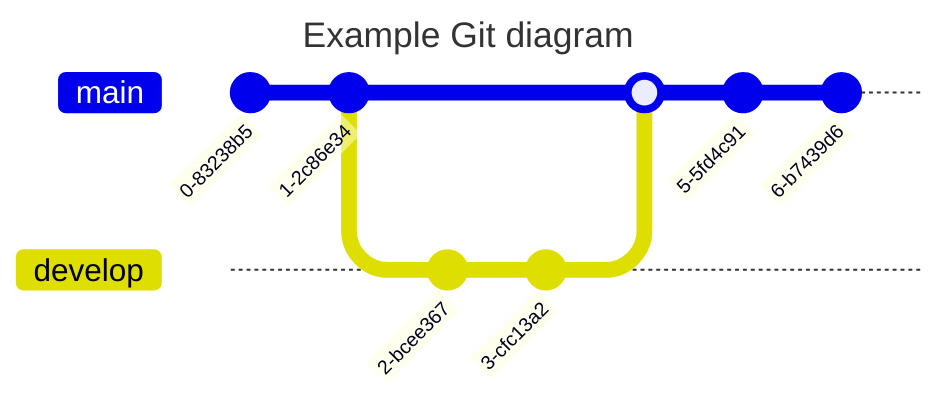

## 实际场景中的使用

> 这部分主要是把前面的思路串起来，用更结构化的方式来表达实际场景中的流程和关系。

## 其他类似工具

> 下面这些工具也非常适合做思维导图、流程图或知识整理：

- [PlantUML](https://plantuml.com/zh/)  
- [Graphviz](https://graphviz.org/)  
- [Typora](https://typora.io/)  
- [Joblin](https://joplinapp.org/)  
- [Swimm](https://swimm.io/)  

