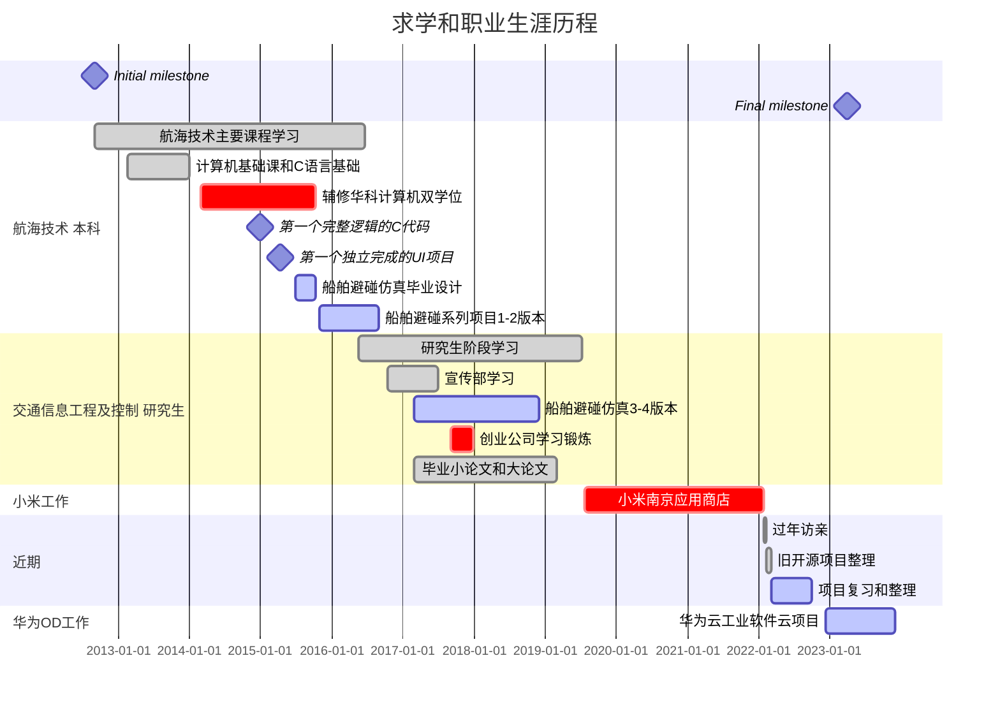

resume
{: .label }

career
{: .label .label-gree }

# 我的简历

> 永不放弃, 保持自信和职业素养  

## 王玉龙 - 软件工程师

> :man:  1993 - ?  
> 教育基础 : 硕士 = 武汉理工--航运学院 | 本科 = 武汉理工--航运学院 | 双学位辅修 = 华中科技--计算机  
> 联系邮箱 : **wangyulong.eron@outlook.com**  
> 职业规划 : 软件工程师/全栈工程师/设计师  

- CV : [English Version](https://github.com/NAVERON/NAVERON/blob/main/ApplyForSoftwareEngineer-WangYuLong-Resume.pdf) + [中文简历](https://github.com/NAVERON/NAVERON/blob/main/%E5%BA%94%E8%81%98%E8%BD%AF%E4%BB%B6%E5%B7%A5%E7%A8%8B%E5%B8%88-%E7%8E%8B%E7%8E%89%E9%BE%99-%E7%AE%80%E5%8E%86.pdf)  
- Code : [Github](https://github.com/NAVERON) + [Gitee](https://gitee.com/naveron) + [Gitlab](https://gitlab.com/NAVERON)  
- Blog : [ChinaBlogs\/cnblogs](https://www.cnblogs.com/eronnav/)  +  [GithubPage\/Jekyll](https://naveron.github.io/)  

> 2014年初课程C语言基础和辅修双学位, 开始接触基础编程知识;  
> 2015年初完成第一个完整项目, 电话联系人管理(Java AWT, Swing), 学习C语言写的简单火车票购买程序(Command Line);  
> 2017年接触编程实习入门, 进入7人小公司学习, 正式接触职场;  
> 2019年硕士毕业进入小米(南京应用商店)工作, 2022年02月离职;  
> 2022年离职后, 02月整理近两年学习所得并整理所有项目, 03月梳理知识点和备战找工作, 独立完成demo项目2个, 规划和进行多个项目;  
> 2022年12月入职华为OD, 工业软件云项目, 用户登录权限相关模块功能开发;  
> ...

## 职业经历

- **华为OD(2022.12 - 2023.12)** : 工业软件云, 后端开发, Java, OAuth2协议, 各种源码学习 ...
- **小米(2019.07 - 2022.02)** : 应用商店, 后端软件工程师, Java, Spring Boot, JSP, Shell, Python ...  
- **武汉创业公司(2017.09 - 2017.11)** : 7人小公司, 协助开发在线教育后台(基于[Edx](https://github.com/openedx/edx-platform)), Python 机器学习和爬虫, 技术选型等  
- **Java系列项目(2015.08 - 2019.04)** : JavaSwing/JavaFx 桌面客户端, 船舶仿真系列软件, 小工具项目  

## 教育基础

1. 武汉理工大学 航运学院 / 交通信息工程及控制 硕士  
    - 起止时间 : 2016.09 - 2019.07  
    - 主要研究方向 : 船舶避碰仿真软件, 树莓派简单使用, 避碰规则的研究  
    - 主要课程 : 水上交通建模与仿真，船舶控制理论与技术，船舶交通流实验等  

2. 武汉理工大学 航运学院 / 航海技术 本科  
    - 起止时间 : 2012.09 - 2016.09  
    - 主要课程 : 船舶原理，航海学（地文+天文），船舶操纵与海上搜救等  
    - 获奖情况 : 成绩良好获得学校二等奖学金，评选为优秀学生干部、优秀毕业生、课外培养优秀学生  

3. 华中科技大学 计算机科学与技术 / 本科辅修双学位  
    - 起止时间 : 2014.03 - 2015.10  
    - 主要课程 : 离散数学，数据结构，操作系统，编译原理, 软件工程等  
    - 参与的实验课程 : 数模, 汇编实验课等  

## 技术积累和项目经验

### 1. Java Spring Boot | 应用自动化测试和审核后台管理系统  

> **技术栈** : Java Spring Boot, Redis, Zookeeper, RPC(Remote Procedure Call), MQ(Message Queue), JSP(Java Server Page), Mysql  

- 船舶管理后台 : [PracticeSpringboot](https://github.com/NAVERON/PracticeSpringboot) + [PracticeJavaFx](https://github.com/NAVERON/PracticeJavaFx)  
- 记账软件思路 : [Ledger](https://github.com/NAVERON/Ledger)  

### 2. JavaFx Python Shell | 船舶避碰仿真软件和机器学习的应用  

> **技术栈** : Java Swing, JavaFx, FXGL, Python PyTorch  

- [问题思考和解决](https://github.com/NAVERON/ArbitraryCoding)  
- [船舶仿真系列开发](https://github.com/NAVERON/ShipSimulation)  
- [脚本等工具制作](https://github.com/NAVERON/ERON)  
- [机器学习笔记和应用](https://github.com/NAVERON/MachineLearningNotes)  

# 我的项目

## 船舶模拟仿真项目

> 完全模拟船舶航行技术和避碰策略, 路径规划等技术的实现  

