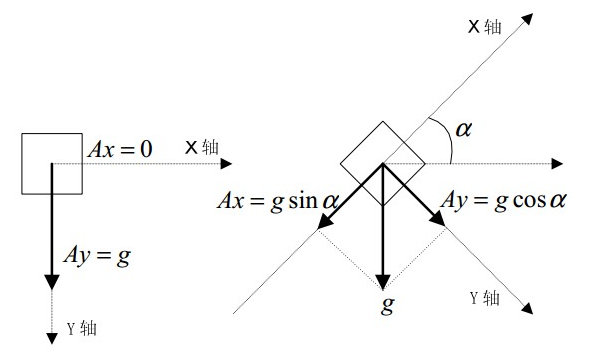
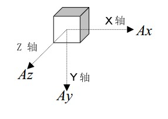

# Arduino C语法

[**详细可以参考已有文件**](../../assert/files/arduino语言说明.pdf)  

## 数据类型

- boolean 布尔
- char 字符类型
- byte 字节类型
- int 整数类型
- unsigned int 无符号整型
- long 长整型
- unsigned long 无符号长整型
- float 实数类型
- double
- string
- array
- void

## 常量

HIGH / LOW 表示数字IO的电平
INPUT / OUTPUT 表示数字IO口的方向，INPUT表示输入，OUTPUT表示输出
true/ false 表示真假

## 结构

void setup() 初始化发量，管脚模式，调用库函数
void loop() 连续执行函数内的语句

## 功能

**数字IO**
- pinMode(pin, mode) 输入输出IO口模式定义函数，pin表示为0~13，mode表示INPUT或者OUTPUT
- digitalWrite(pin, value) 数字IO口输出电平定义函数，pin表示0~13，value表示为HIGH或者LOW
- int digitalRead(pin) shuziio口读取输入电平函数，pin表示0~13返回值表示高电平或者低电平HIGH or LOW

**模拟IO**
- int analogRead(pin)\_ 模拟io口读函数，pin表示0~5(根据硬件的接口来定)
- analogWrite(pin, value)\_PWM 数字io口PWM输出函数，arduino数字io口标注了PWM的IO口可使用该函数，pin表示3，5，6，9，10，11，value表示0~255

**时间函数**
- delay(ms) 延时函数，单位ms
- delayMicroseconds(us) 延时函数，单位us

**数学函数**
- min(x, y) 求最小值
- max(x, y) 求最大值
- abs(x) 计算绝对值
- constrain(x, a, b) 约束函数，下限a， 上限b， x必须在ab之间才能返回
- map(value, fromLow, fromHigh, toLow, toHigh) 约束函数，value必须在范围值之间
- pow(base, exponent) 开方函数，base的exponent次方
- sq(x) 平方
- sqrt(x) 开平方

# ADXL335

> 3自由度加速度计量传感器  

## ADXL335三轴加速计的使用案例

[**根据加速度求取倾角的原理(官方)**](../../assert/files/ADXL335倾角计算原理.pdf)  
官方网站针对加速计的使用进行了详细说明  

[**参考地址CSDN**](http://blog.csdn.net/ling3ye/article/details/51469152)  
使用加速计进行读取数据的案例  

[**官方网址**](http://www.analog.com/cn/products/mems/accelerometers/adxl335.html#product-overview)  
对ADXL335型号加速计详细的介绍，包括硬件部分  

## 根据加速度求取倾角的具体计算过程：

[百度上的参考](https://wenku.baidu.com/view/c63b187c5acfa1c7aa00cc7c.html)  

  

如图所示，有 $$ A_x = g \sin \alpha $$, $$ A_y = g \cos \alpha $$, then $$ \frac{A_x}{A_y} = \tan \alpha $$, 即 $$ \alpha = \arctan( \frac{A_x}{A_y} ) $$  
这样，就可以根据在x、y轴上的加速度求取倾斜角度  

> 注意：这是静止状态，运动过程需要提高采样频率  

**二维平面具有局限性，所以使用3维的加速度计算**  

与上面类似的计算过程，可以得出倾斜角度公式  $$ \alpha = \arctan \frac {\sqrt{ A_x^2 + A_z^2 }}{A_y} $$

> ~~因为双`{{`问题导致语法编译错误, 暂时使用原始公式表达式~~  

  

`x`需要说明的是，这里利用的是物体静止时受到重力的性质，如果物体同时也有加速度的话，这个公式不再准确, 需要增加一个限制条件

$$
\begin {cases}
\alpha = \arctan(\frac{\sqrt { A_x^2 + A_y^2 }}{A_y})  \\
\sqrt{ A_x^2 + A_z^2 + A_y^2 } = 1g
\end{cases}
$$

### 软件算法

如上公式所示的计算方法  
**反三角函数算法**  
1. 测量xyz三轴的加速度，Ax、Ay、Az
2. 计算$$A_x^2 + A_z^2 + A_y^2$$，如果这个平方接近1g的平方，那么说明这组采样值是有效的，可以用来计算，否则丢弃，重复第一步
3. 利用有效的采样值，通过开平方和反正切函数的科学计算，计算出倾斜角度$$alpha = \arctan(\frac{\sqrt{A_x^2+A_z^2}}{A_y})$$  
4. 重复第一步

**查表算法**  

第一种算法的计算两庞大，需要高性能硬件的配合。如果避开这些计算，则可以大幅度降低算法复杂度  
分两步降低算法复杂度：  
1. 利用整数开方代替C函数开方  
2. 利用查表代替正切计算，即提前计算每个角度$$\alpha$$的正切值$$\tan$$，并保存在EEPROM中，那么在计算过程中，只需要计算$$\frac{\sqrt{A_x^2 + A_z^2}}{A_y}$$，并在表中查找接近的正切值，那么相应的角度就是所求角度  

### 倾斜角度的精度与角速度的分辨率之间的额关系  

根据前面的计算公式，又有$$\sqrt{A_x^2+A_y^2+A_z^2} = 1g$$可以简化公式为$$\alpha = \arctan(\frac{\sqrt{(1g)^2 - A_y^2}}{A_y})$$, 公式中只有一个变量Ay  

倾斜角度越大，精度越低，具体参考前面的百度网址  

